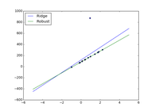
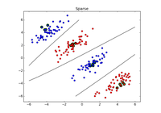
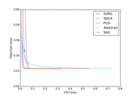

.. raw:: html

    

Examples
========

.. _examples-index:

.. raw:: html

    

.. figure:: ./images/thumb/plot_sgd_loss_functions.png
   :target: ./plot_sgd_loss_functions.html

   :ref:`plot_sgd_loss_functions.py`

.. raw:: html

    

.. toctree::
   :hidden:

   ./plot_sgd_loss_functions

.. raw:: html

    

   :ref:`plot_robust_regression.py`

.. raw:: html

    

.. toctree::
   :hidden:

   ./plot_robust_regression

.. raw:: html

    

.. figure:: ./images/thumb/trace.png
   :target: ./trace.html

   :ref:`trace.py`

.. raw:: html

    

.. toctree::
   :hidden:

   ./trace

.. raw:: html

    

.. figure:: ./images/thumb/document_classification_news20.png
   :target: ./document_classification_news20.html

   :ref:`document_classification_news20.py`

.. raw:: html

    

.. toctree::
   :hidden:

   ./document_classification_news20

.. raw:: html

    

.. figure:: ./images/thumb/plot_svrg.png
   :target: ./plot_svrg.html

   :ref:`plot_svrg.py`

.. raw:: html

    

.. toctree::
   :hidden:

   ./plot_svrg

.. raw:: html

    

   :ref:`plot_sparse_non_linear.py`

.. raw:: html

    

.. toctree::
   :hidden:

   ./plot_sparse_non_linear

.. raw:: html

    

   :ref:`plot_l2_solvers.py`

.. raw:: html

    

.. toctree::
   :hidden:

   ./plot_l2_solvers

.. raw:: html

    

    