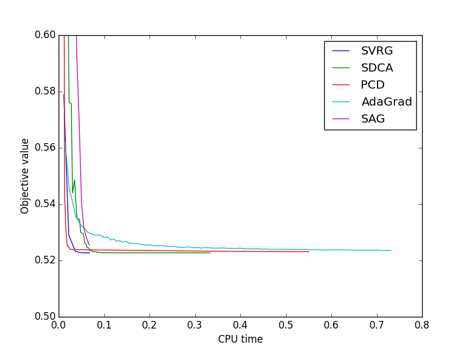

.. _plot_l2_solvers.py:

=====================
L2 solver comparison
=====================

**Script output**::

  SVRG
  SDCA
  PCD
  AdaGrad
  SAG

**Python source code:** :download:`plot_l2_solvers.py <plot_l2_solvers.py>`

.. literalinclude:: plot_l2_solvers.py
    :lines: 6-

**Total running time of the example:**  2.30 seconds
    